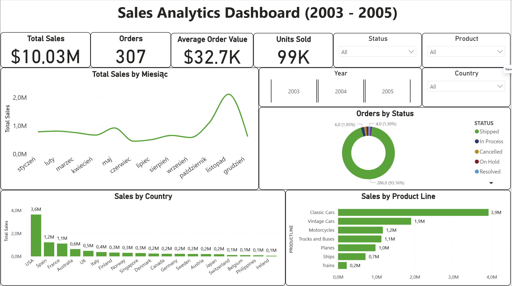

📊 Sales Analytics Dashboard – Power BI Project

This repository contains an end-to-end Sales Analytics Dashboard built in Power BI, showcasing data cleaning, data modeling, DAX measures, and interactive visualizations for business insights.

The goal of this project is to analyze company sales performance across years, product categories, and regions.

🚀 Project Overview

Tool: Power BI Desktop
Source: Kaggle – Sample Sales Data
Process included:

Data cleaning & shaping in Power Query

Data modeling & relationship management

Building DAX measures for KPIs

Creating a fully interactive dashboard with slicers and drill-downs

Preparing the report for professional portfolio usage

## 📁 Repository Structure

```text
Sales-Analytics-Dashboard/
│
├── data/
│   └── sales_data_sample.csv
│
├── report/
│   └── Sales_Analytics_Dashboard.pbix
│
├── screenshots/
│   ├── dashboard_main.png
│   ├── slicers_01.png
│
└── README.md
```


📈 Key KPIs (DAX Measures)
🔹 Total Sales
Total Sales = SUM('SALES'[SALES])

🔹 Number of Orders
Number of Orders = DISTINCTCOUNT('SALES'[ORDERNUMBER])

🔹 Total Quantity
Total Quantity = SUM('SALES'[QUANTITYORDERED])

🔹 Average Order Value (AOV)
Average Order Value = [Total Sales] / [Number of Orders]

🧹 Data Cleaning & Power Query Steps

The raw dataset required multiple transformations:

✔ Converted date column to proper datetime format
✔ Created new calculated columns (Expected Sales, Sales Match)
✔ Standardized text fields
✔ Repaired missing Territory values (USA → “NA”)
✔ Created Customer Full Name
✔ Ensured correct data types for numeric and categorical fields
✔ Removed unnecessary columns
✔ Sorted and structured the table for data modeling

These steps can be viewed directly inside the Power Query Editor in the PBIX report.

📊 Dashboard Preview

Below are screenshots of the final interactive dashboard:

🖥️ Full Dashboard



🔍 Insights Highlights

Some key findings from the analysis:

2004 is the best-performing year with the highest total sales

Motorcycles and Classic Cars are the top product categories

USA, France, and Spain generate the most revenue

93% of orders are “Shipped”, indicating strong fulfillment operations

Only 1–2% of orders fall into problem categories (Cancelled, Disputed, On Hold)

🎯 Purpose of the Project

This project demonstrates:

Strong skills in Power Query, DAX, and data modeling

Ability to design clear, professional BI dashboards

Good understanding of business KPIs and data storytelling

End-to-end analytical workflow: from raw data → to insights → to interactive report

It serves as part of a growing Business Intelligence portfolio.

👤 Author

Tomasz Gwiazda
Aspiring Data Analyst / Business Intelligence Analyst
📍 Poland
🔗 GitHub: https://github.com/tomgw88](https://github.com/tomgw88/Sales-Analytics-Dashboard)
